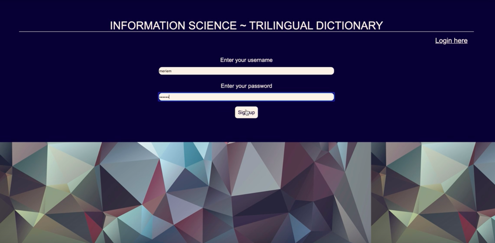
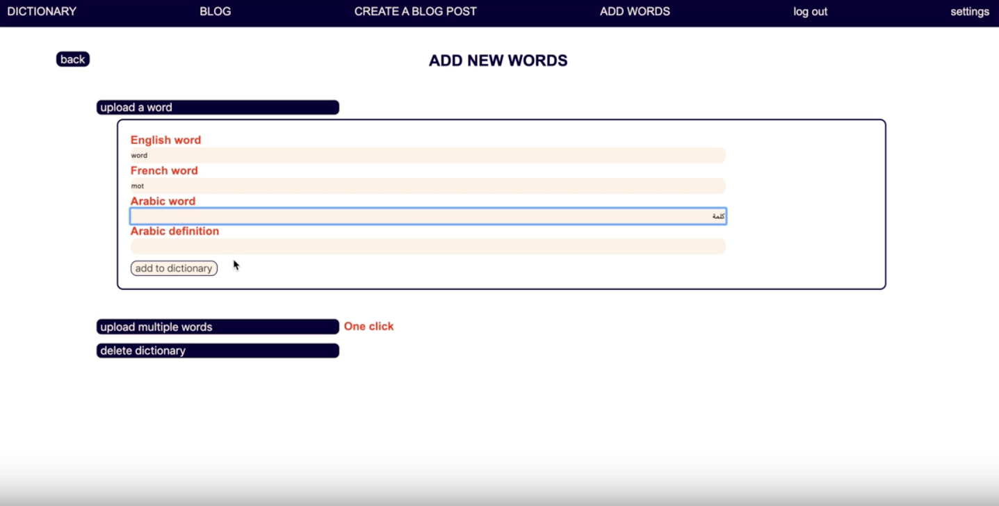

**Dictionary and Blog - Web App – individual project**

- **Front-end :** JavaScript, React, Redux, CSS
- **Back-end :** Node.js, Express, MongoDB
- **Other tools:** Git, Github, Postman

*Project video available*: https://bit.ly/2miVscZ

**The project consists in creating a Trilingual Dictionary and Blog from scratch and making available the following functionalities:**

- signup / login

---
- user management with access control

---
- search engine / back-end pagination

---
- upload dictionary in one click / delete dictionary  / add a word - (admin only)

---
- display blog posts / create new blog posts (admin only)

